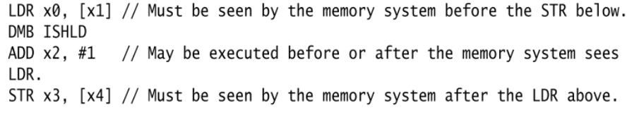
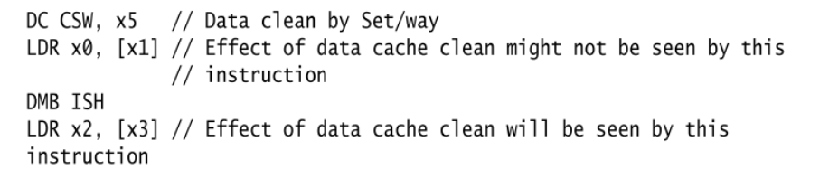
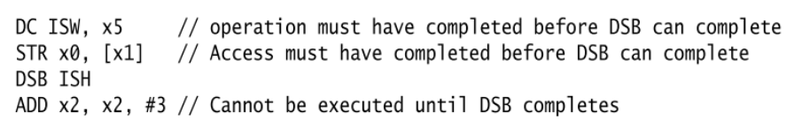
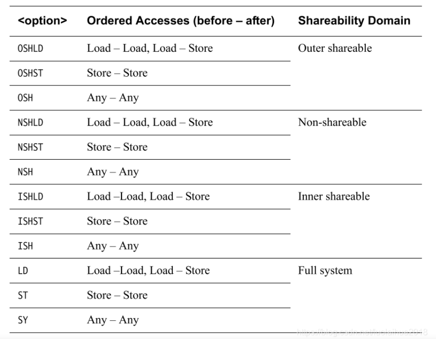

###
### 1 Memory Barrier
***
ARM体系结构包括屏障指令，用于在特定点强制访问顺序和访问完成。在某些体系结构中，类似的指令称为fence。

在此架构中，有三条屏障指令：

**Instruction Synchronization Barrier (ISB)**
**Data Memory Barrier (DMB)**
**Data Synchronization Barrier (DSB)**

####1.1 **指令同步屏障（ISB）**
   **这是用来保证任何后续的指令都会再次被获取（指令流水线被刷新）**，以便使用当前的MMU配置检查特权和访问权限。它用于确保任何先前执行的**上下文更改操作**（如对系统控制寄存器的写入）在ISB完成时已经完成。
   例如，在硬件方面，这可能意味着指令流水线被刷新。它的典型用途是内存管理、缓存控制和上下文切换代码，或者在内存中移动代码。
   ARMv8体系结构将**上下文**定义为**系统寄存器的状态**，并将**上下文更改操作**定义为**缓存、TLB和分支预测器维护操作，或对系统控制寄存器的更改**，例如SCTLR_EL1、TCR_EL1和TTBRn_EL1。这种上下文更改操作的效果只能保证在上下文同步事件之后才能看到。
   
   有三种上下文同步事件
   1. 异常发生
   2. 从异常返回
   3. Instruction Synchronization Barrier (ISB)
   
   ISB刷新流水线，并从缓存或内存中重新获取指令，并**确保ISB之前完成的任何上下文更改操作的效果对ISB之后的任何指令都可见**。它还确保在ISB指令之后的任何上下文更改操作只在ISB执行之后生效，并且ISB之前的指令看不到这些操作。这并不意味着在每个修改处理器寄存器的指令之后都需要ISB。例如，对PSTATE字段、ELR、SP和SPSR的读取或写入，按程序顺序相对于其他指令进行。
#### 1.2 Data Memory Barrier (DMB)
这可以防止跨屏障指令对数据访问指令进行重新排序。**在DMB之后的任何数据访问之前，该处理器在DMB之前执行的所有数据访问**（即加载或存储，而不是指令获取）对指定共享域中的所有其他主控机可见。

它可确保会先检测到程序中位于DMB指令前的所有**内存访问指令**，然后再检测到程序中位于DMB指令后的显式内存访问指令。它不影响其它指令在处理器上的执行顺序。



如上述指令，在LDR加载指令之后执行了DMB，由于DMB指令只对内存访问指令有效，所以ADD指令可以在LDR之前或者之后执行，但是STR指令会受到影响，它必须在LDR指令执行完毕后，才会执行STR。

**它还确保在执行任何后续数据访问之前，任何显式的先前数据缓存（data cache）或统一缓存（unified cache）维护操作都已完成**。

如上述指令，在缓存维护指令DC之后执行了LDR指令，LDR指令可能在DC指令执行完毕之前或者之后执行。但是在DMB指令之后的LDR，一定是在DMB之前的DC和LDR指令执行完毕后，再执行

#### 1.3 Data Synchronization Barrier (DSB)
此指令的强制执行顺序与DMB类似，但具有**阻止执行任何进一步指令的附加效果**，而不仅仅是加载或存储，或两者兼而有之，**直到同步完成**。这可以用来阻止SEV指令的执行，例如，SEV指令会向其他内核发出发生事件的信号。它将等待此处理器发出的所有缓存、TLB和分支预测器维护操作完成，以用于指定的可共享性域。

如上述指令，如果是DMB，最后的ADD不会受影响，但是DSB会影响任何进一步需要执行的指令。ADD必须在DC和STR指令执行完成后才会执行。只有当此指令执行完毕后，才会执行程序中位于此指令后的指令。

当满足以下条件时，此指令才会完成：
1. 位于此指令前的所有显示内存访问均完成。
2. 位于此指令前的所有缓存、跳转预测和TLB维护操作全部完成。


#### 1.4 指令参数
有序访问字段指定屏障操作的访问类别。有三种选择：


**Load - Load/Store**
这意味着屏障需要在屏障之前完成所有load，但不需要完成store。在程序顺序中出现在屏障之后的加载和存储都必须等待屏障完成。

**Store - Store**
这意味着屏障只影响存储访问，负载仍然可以围绕屏障自由重新排序。

**Any - Any**
 这意味着装载和存储必须在屏障之前完成。在程序顺序中出现在屏障之后的加载和存储都必须等待屏障完成。    
</br>
</br>
</br>


### 2. barrier.h
***
```c
#ifndef __ASM_BARRIER_H
#define __ASM_BARRIER_H

#ifndef __ASSEMBLY__

#define __nops(n)	".rept	" #n "\nnop\n.endr\n"
#define nops(n)		asm volatile(__nops(n))

#define sev()		asm volatile("sev" : : : "memory")
#define wfe()		asm volatile("wfe" : : : "memory")
#define wfi()		asm volatile("wfi" : : : "memory")

#define isb()		asm volatile("isb" : : : "memory")
#define dmb(opt)	asm volatile("dmb " #opt : : : "memory")
#define dsb(opt)	asm volatile("dsb " #opt : : : "memory")

#define psb_csync()	asm volatile("hint #17" : : : "memory")
#define csdb()		asm volatile("hint #20" : : : "memory")

#define mb()		dsb(sy)
#define rmb()		dsb(ld)
#define wmb()		dsb(st)

#define dma_rmb()	dmb(oshld)
#define dma_wmb()	dmb(oshst)

/*
 * Generate a mask for array_index__nospec() that is ~0UL when 0 <= idx < sz
 * and 0 otherwise.
 */
#define array_index_mask_nospec array_index_mask_nospec
static inline unsigned long array_index_mask_nospec(unsigned long idx,
						    unsigned long sz)
{
	unsigned long mask;

	asm volatile(
	"	cmp	%1, %2\n"
	"	sbc	%0, xzr, xzr\n"
	: "=r" (mask)
	: "r" (idx), "Ir" (sz)
	: "cc");

	csdb();
	return mask;
}

#define __smp_mb()	dmb(ish)
#define __smp_rmb()	dmb(ishld)
#define __smp_wmb()	dmb(ishst)

#define __smp_store_release(p, v)					\
do {									\
	union { typeof(*p) __val; char __c[1]; } __u =			\
		{ .__val = (__force typeof(*p)) (v) }; 			\
	compiletime_assert_atomic_type(*p);				\
	switch (sizeof(*p)) {						\
	case 1:								\
		asm volatile ("stlrb %w1, %0"				\
				: "=Q" (*p)				\
				: "r" (*(__u8 *)__u.__c)		\
				: "memory");				\
		break;							\
	case 2:								\
		asm volatile ("stlrh %w1, %0"				\
				: "=Q" (*p)				\
				: "r" (*(__u16 *)__u.__c)		\
				: "memory");				\
		break;							\
	case 4:								\
		asm volatile ("stlr %w1, %0"				\
				: "=Q" (*p)				\
				: "r" (*(__u32 *)__u.__c)		\
				: "memory");				\
		break;							\
	case 8:								\
		asm volatile ("stlr %1, %0"				\
				: "=Q" (*p)				\
				: "r" (*(__u64 *)__u.__c)		\
				: "memory");				\
		break;							\
	}								\
} while (0)

#define __smp_load_acquire(p)						\
({									\
	union { typeof(*p) __val; char __c[1]; } __u;			\
	compiletime_assert_atomic_type(*p);				\
	switch (sizeof(*p)) {						\
	case 1:								\
		asm volatile ("ldarb %w0, %1"				\
			: "=r" (*(__u8 *)__u.__c)			\
			: "Q" (*p) : "memory");				\
		break;							\
	case 2:								\
		asm volatile ("ldarh %w0, %1"				\
			: "=r" (*(__u16 *)__u.__c)			\
			: "Q" (*p) : "memory");				\
		break;							\
	case 4:								\
		asm volatile ("ldar %w0, %1"				\
			: "=r" (*(__u32 *)__u.__c)			\
			: "Q" (*p) : "memory");				\
		break;							\
	case 8:								\
		asm volatile ("ldar %0, %1"				\
			: "=r" (*(__u64 *)__u.__c)			\
			: "Q" (*p) : "memory");				\
		break;							\
	}								\
	__u.__val;							\
})

#define smp_cond_load_acquire(ptr, cond_expr)				\
({									\
	typeof(ptr) __PTR = (ptr);					\
	typeof(*ptr) VAL;						\
	for (;;) {							\
		VAL = smp_load_acquire(__PTR);				\
		if (cond_expr)						\
			break;						\
		__cmpwait_relaxed(__PTR, VAL);				\
	}								\
	VAL;								\
})

#include <asm-generic/barrier.h>

#endif	/* __ASSEMBLY__ */

#endif	/* __ASM_BARRIER_H */
```